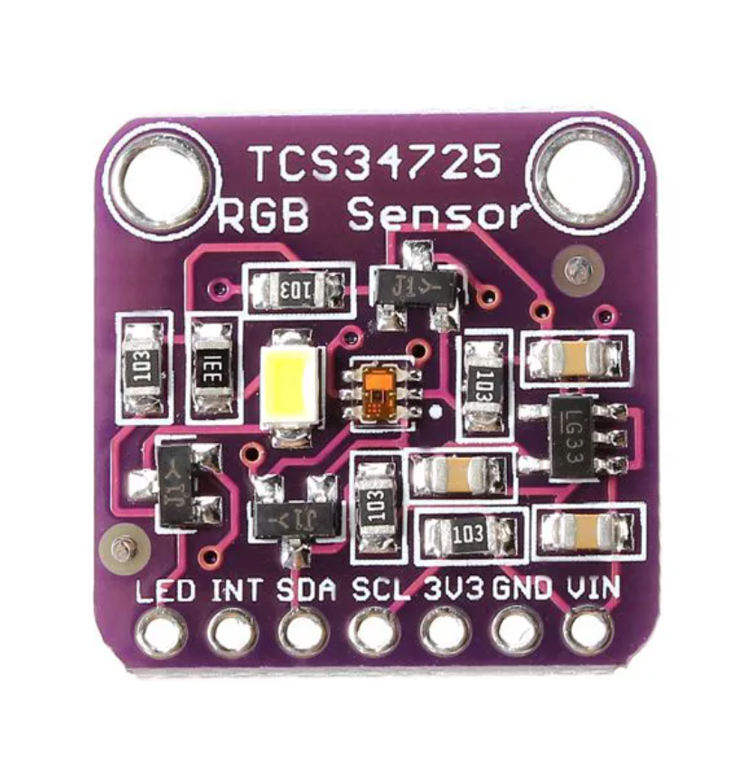
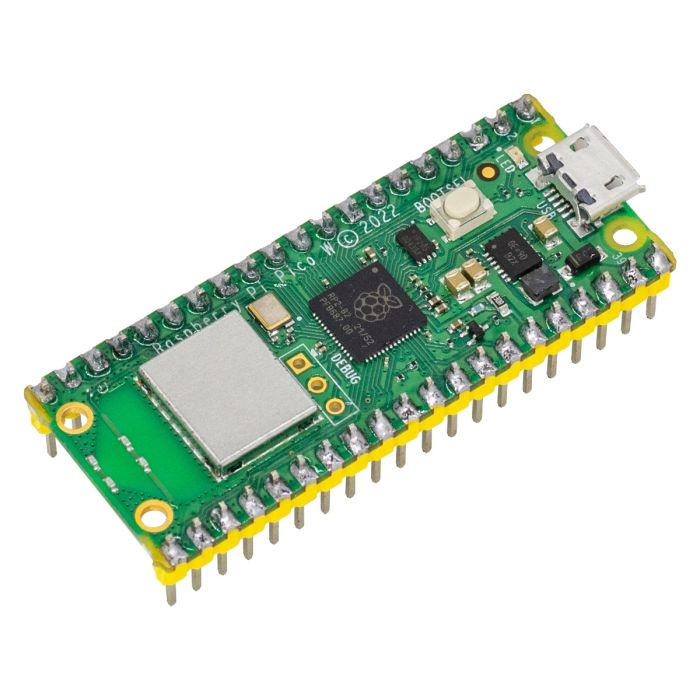
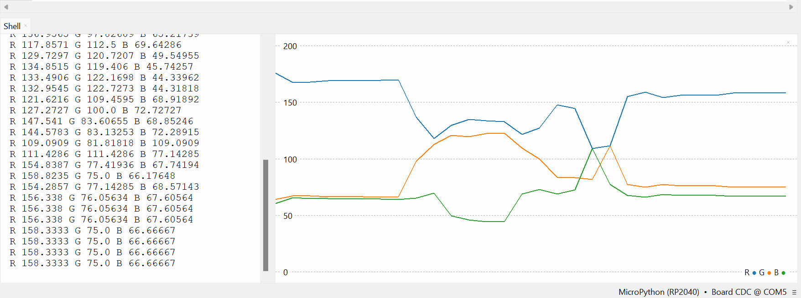

# sensor RGB
 
Este repositório foi criado com o intuito de realizar a entrega da atividade "Implementação de um Sistema de Comunicação Entre Computador e Sistema Embarcado"

# Materiais utilizados

- Sensor de cor RGB - TCS34725

- Raspberry Pi Pico w

# Interface Gráfica do Usuário

Como interface do usuário, utilizei o Plotter disponibilizado pelo Thonny IDE, como uma forma de visualizar os dados coletados pelo sensor

# Montagem

| TCS34725| Raspberry Pi Pico w |
|-------------|-------------|
| VIN | VBUS | 
| GND | GND |  
| SCL | GP5 | 
| SDA | GP4 | 